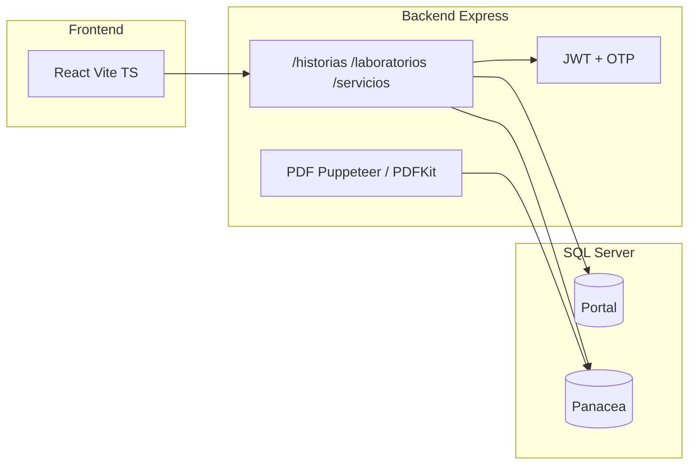

# Análisis del proyecto portal-hospital

Documento generado a partir del análisis del repositorio: propósito, arquitectura, módulos principales y flujos.

## Qué es

**portal-hospital** es un **portal del paciente** que expone, de forma segura, información clínica ya existente en el hospital. El contexto documentado apunta a **E.S.E. Hospital San Juan de Dios Marinilla** (véase `backend/ENVIO_HISTORIAS.md`): el paciente accede con datos de identidad y un **código OTP** enviado al correo, y puede consultar **historias clínicas** y **resultados de laboratorio**, además de obtener **PDF** de la historia.

Los datos clínicos **no se duplican como fuente de verdad**: el backend se conecta a **dos bases de datos Microsoft SQL Server**:

- **BD del portal** (`portalPool` en `backend/config/db.js`): OTP, migraciones propias (p. ej. auditoría de envíos), vistas auxiliares.
- **BD Panacea** (`panaceaPool`): stored procedures nativos del HIS (`Historia.*`, `Laboratorio.*`, etc.), alineados con la lógica legacy del ecosistema Panacea.

## Arquitectura (alto nivel)

## Backend (`backend/`)

- **Runtime**: Node.js, **Express 5**, punto de entrada `backend/index.js`.
- **Seguridad**: `helmet`, CORS hacia el frontend, **rate limiting** global y más estricto en login/OTP (`backend/routes/servicios.routes.js`).
- **Rutas principales**:
  - `POST /servicios/autenticar` y `POST /servicios/verificar-otp`: identidad (tipo/número documento + fecha nacimiento) → OTP por correo → JWT (`backend/services/auth.service.js`).
  - `/historias/*`: listado, detalle, descarga PDF, solicitud OTP para PDF (`backend/routes/historias.routes.js`) — rutas protegidas con `authMiddleware`.
  - `/laboratorios/*`: resultados de laboratorio.
- **Integración Panacea**: capa en `backend/services/panacea/` (p. ej. `historiaSP.js`, `laboratorioSP.js`) que ejecuta SPs y normaliza columnas.
- **Correo**: Nodemailer (`backend/config/mailer.js`) para OTP y flujos de envío.
- **PDF**: generación con **Puppeteer** / **PDFKit**; **cifrado AES** del PDF para envíos por email (`backend/services/pdf.encrypt.js`, dependencia `muhammara`).
- **Health check**: `GET /health`.
- **Automatización fuera del navegador**: CLI `backend/cli/enviar-historia.js` y lanzadores `.bat` descritos en `ENVIO_HISTORIAS.md` (envío single, masivo CSV, programado; idempotencia/auditoría en tabla `envios_historia` vía migraciones).

**package.json** (`backend/package.json`): descripción *"Backend API del Portal del Paciente - Hospital"*.

### Dependencias destacables (backend)

- `express`, `cors`, `helmet`, `express-rate-limit`, `express-validator`
- `mssql`, `msnodesqlv8`
- `jsonwebtoken`, `bcryptjs`
- `nodemailer`
- `puppeteer`, `pdfkit`, `muhammara`
- `dotenv`, `uuid`, `p-limit`

## Frontend (`frontend/src/`)

- **Stack**: React, TypeScript, Vite, React Router (`frontend/src/App.tsx`).
- **Flujo UX**: landing y `/servicios` públicos; tras OTP, rutas protegidas para **historias** (`/historias`, `/historias/:id`) y **laboratorios** (`/laboratorios`, `/laboratorios/:id`). Contexto de auth en `frontend/src/contexts/AuthContext.tsx`; cliente HTTP en `frontend/src/services/api.ts`.
- El `README` del frontend es el **template genérico de Vite**; no documenta el dominio hospitalario (`frontend/README.md`).

## Envío automatizado de historias (`backend/ENVIO_HISTORIAS.md`)

Sistema para **enviar la historia clínica por correo** sin pasar por el frontend: script Node invocable desde `.bat`. El PDF puede ir **cifrado** y abrirse con la **cédula o documento** del paciente como contraseña.

Componentes clave citados en esa documentación:

| Capa | Archivo | Función |
|------|---------|---------|
| Servicio | `backend/services/pdf.encrypt.js` | Cifrado AES-128 del PDF con documento como clave |
| Servicio | `backend/services/envio.historia.service.js` | Orquestación paciente → PDF Panacea → cifrado → correo → auditoría |
| CLI | `backend/cli/enviar-historia.js` | Modos: `single`, `csv`, `programado` |
| Lanzadores | `backend/bin/*.bat` | Single, bulk CSV, programado (Task Scheduler) |
| BD | Tabla `envios_historia` | Auditoría e idempotencia (migraciones) |

## Artefactos de datos / esquema

En el proyecto existen JSON de referencia: `db_schema.json`, `schema.json`, `codigos_otp_schema.json`, y scripts de inspección/actualización (`inspect_db.js`, `update_schema.js`, etc.) para alinear con Panacea.

## Conclusión

En una frase: **es el Portal del Paciente que une una SPA React con una API Express sobre SQL Server, leyendo historia y laboratorios desde Panacea, con autenticación por OTP y soporte de PDF (incluido envío masivo cifrado por correo para funcionarios o sistemas batch).**
