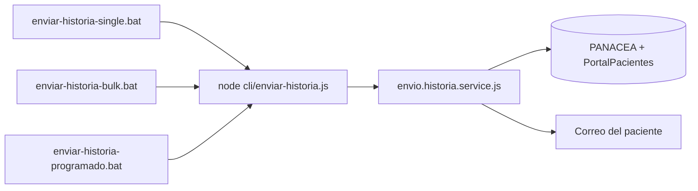
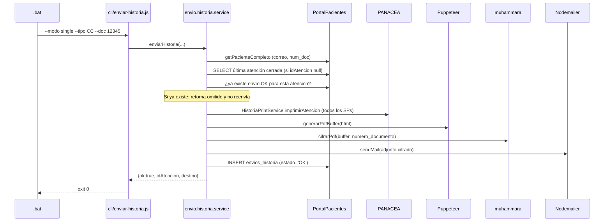

# Envío Automatizado de Historias Clínicas
*E.S.E Hospital San Juan de Dios Marinilla — Portal del Paciente*

Este documento describe el sistema que permite **enviar la historia clínica de un paciente por correo electrónico** sin pasar por el frontend, usando un script Node invocado desde tres archivos `.bat`. El PDF llega cifrado y solo se puede abrir con la **cédula o tarjeta de identidad** del paciente como contraseña.

---

## 1. Qué se construyó

### 1.1 Componentes nuevos

| Capa | Archivo | Función |
|------|---------|---------|
| Servicio | [`backend/services/pdf.encrypt.js`](services/pdf.encrypt.js) | Cifra el PDF con AES-128 usando como contraseña el número de documento. |
| Servicio | [`backend/services/envio.historia.service.js`](services/envio.historia.service.js) | Orquesta paciente → PDF Panacea → cifrado → correo → auditoría. |
| CLI | [`backend/cli/enviar-historia.js`](cli/enviar-historia.js) | Punto de entrada Node con tres modos: `single`, `csv`, `programado`. |
| Lanzadores | [`backend/bin/enviar-historia-single.bat`](bin/enviar-historia-single.bat) | Envío puntual de un paciente (interactivo o por argumentos). |
| Lanzadores | [`backend/bin/enviar-historia-bulk.bat`](bin/enviar-historia-bulk.bat) | Envío masivo desde un archivo CSV. |
| Lanzadores | [`backend/bin/enviar-historia-programado.bat`](bin/enviar-historia-programado.bat) | Disparado por Windows Task Scheduler para enviar atenciones nuevas. |
| BD | Tabla `envios_historia` | Auditoría e idempotencia (creada automáticamente por las migraciones). |

### 1.2 Cambios en archivos existentes

- [`backend/services/pdf.service.js`](services/pdf.service.js): se separó la generación del PDF en `generarPdfBuffer()` (reusable) y `generarPdfDesdeHtml()` (sigue funcionando para el endpoint HTTP). Se agregó `cerrarBrowser()` para el CLI.
- [`backend/config/migrations.js`](config/migrations.js): se agregó la tabla `envios_historia` y dos índices (uno de consulta, otro único parcial que bloquea reenvíos).
- [`backend/.env.example`](.env.example): nuevas variables `ENVIO_CONCURRENCIA`, `ENVIO_FUENTE_DEFAULT`, `ENVIO_MAX_PROGRAMADO`.

### 1.3 Dependencias añadidas

- `muhammara` → cifrado AES-128 del PDF (con prebuilts para Windows x64).
- `p-limit@^3.x` → control de concurrencia en los modos `csv` y `programado` (3 PDFs en paralelo por defecto).

---

## 2. Cómo funciona cada `.bat`

Los tres `.bat` están en `backend/bin/` y todos invocan el **mismo** script Node (`backend/cli/enviar-historia.js`). Lo único que cambia entre ellos es **qué argumentos le pasan**.



### 2.1 `enviar-historia-single.bat` — un paciente puntual

Pensado para que un funcionario de soporte envíe la historia clínica a un paciente concreto. Acepta dos formas de uso:

**A) Modo interactivo (sin argumentos):**
```bat
backend\bin\enviar-historia-single.bat
```
El `.bat` pregunta:
```
Tipo de documento [CC/TI/CE/PT/PA/OTRO]: CC
Numero de documento: 1234567890
```

**B) Modo no interactivo (con argumentos):**
```bat
backend\bin\enviar-historia-single.bat CC 1234567890
backend\bin\enviar-historia-single.bat CC 1234567890 359695
```

| Argumento | Posición | Obligatorio | Descripción |
|-----------|----------|-------------|-------------|
| Tipo doc  | `%1` | Sí (o se pregunta) | `CC`, `TI`, `CE`, `PT`, `PA`, `OTRO` |
| Número doc | `%2` | Sí (o se pregunta) | Número del paciente |
| ID atención | `%3` | No | Si se omite, envía la **última atención cerrada** del paciente |

**Lo que hace por dentro:**
1. Cambia el directorio a `backend/`.
2. Pregunta lo que falte.
3. Llama a `node cli\enviar-historia.js --modo single --tipo XX --doc XX [--atencion XX]`.

### 2.2 `enviar-historia-bulk.bat` — lote desde CSV

Pensado para reprocesos o jornadas masivas (ej. enviar todas las historias de la jornada de vacunación).

**Uso:**
```bat
REM Usa el archivo por defecto backend\envios\pacientes.csv
backend\bin\enviar-historia-bulk.bat

REM Con un CSV en otra ruta
backend\bin\enviar-historia-bulk.bat C:\datos\jornada-mayo.csv
```

**Formato del CSV** (UTF-8, separador `,` `;` o tab, encabezado opcional):

```csv
tipo_documento,numero_documento,id_atencion
CC,1234567890,359695
CC,9876543210,
TI,1122334455,360001
```

- La cabecera es **opcional** (se detecta automáticamente).
- La columna `id_atencion` es **opcional** por fila: si se deja vacía, envía la última atención cerrada del paciente.

**Lo que hace por dentro:**
1. Verifica que el CSV exista, si no muestra ayuda y termina con código 1.
2. Llama a `node cli\enviar-historia.js --modo csv --archivo "..."`.
3. El CLI procesa **3 pacientes en paralelo** (`ENVIO_CONCURRENCIA`) y registra cada uno en `envios_historia`.

### 2.3 `enviar-historia-programado.bat` — para Windows Task Scheduler

Pensado para correr **automáticamente cada hora (o el intervalo que se prefiera)**. Detecta atenciones cerradas en Panacea (`id_estado IN (2,3)`) que aún no tienen un envío `OK` registrado y las despacha hasta el límite `ENVIO_MAX_PROGRAMADO` (200 por defecto).

**Uso manual de prueba:**
```bat
backend\bin\enviar-historia-programado.bat
```

**Registro en Task Scheduler (PowerShell, ejemplo cada hora):**
```powershell
schtasks /Create /TN "Portal\EnviarHistoriasProgramado" `
  /TR "C:\Portal-Hospital\backend\bin\enviar-historia-programado.bat" `
  /SC HOURLY /MO 1 /RU SYSTEM
```

**Lo que hace por dentro:**
1. Construye la fecha de inicio del **día actual** en formato `YYYY-MM-DDT00:00:00` (la ventana de búsqueda).
2. Llama a `node cli\enviar-historia.js --modo programado --desde "..."`.
3. Redirige toda la salida a `backend/logs/programado.log` para que Task Scheduler quede limpio.

> Si su VM usa un *locale* distinto a `es-CO` (formato de `%date%` diferente), debe ajustar las posiciones de `DD`, `MM`, `YYYY` dentro del `.bat`.

---

## 3. Códigos de salida (útiles para Task Scheduler)

| Código | Significado |
|--------|-------------|
| `0` | Todo ejecutado correctamente (o no había nada que enviar). |
| `1` | Argumentos inválidos (ej. CSV no existe, faltó el documento). |
| `2` | Error fatal de conexión / configuración (BD caída, SMTP no responde, `muhammara` no instalado). |
| `3` | Procesamiento parcial: algunos pacientes se enviaron, otros fallaron. Ver el log. |

Task Scheduler puede usar estos códigos para reintentos automáticos o alertas.

---

## 4. Flujo interno por cada paciente

El servicio [`envio.historia.service.js`](services/envio.historia.service.js) ejecuta estos pasos en orden:



**Garantías que da el sistema:**

- **Trazabilidad en Panacea:** los SPs se ejecutan con el usuario `Portal_Pacientes`, dejando la misma huella en SQL Profiler que un envío desde la app Silverlight.
- **Idempotencia:** la tabla `envios_historia` tiene un índice único parcial sobre `id_atencion WHERE estado='OK'`, así si el `.bat` se relanza por accidente la base de datos rechaza el reenvío.
- **Privacidad:** el PDF jamás se persiste en disco. Solo viaja por memoria desde Puppeteer hasta Nodemailer.
- **Seguridad:** el adjunto está cifrado AES-128. Si el correo se reenvía, el atacante no podrá abrir el PDF sin la cédula del titular.
- **Aislamiento:** el CLI tiene su propio pool de Puppeteer y se apaga al terminar; no interfiere con las 4 instancias de PM2 del backend HTTP.

---

## 5. Cómo probar **con un documento específico**

### 5.1 Pre-requisitos (una sola vez)

1. **Asegúrese de que el backend ya levantó al menos una vez** después de los cambios, para que se cree la tabla `envios_historia`. Desde `backend/`:
   ```bash
   npm install
   pm2 restart portal-hospital-backend
   pm2 logs --lines 20
   ```
   Debe ver `✅ Migraciones y vistas ejecutadas correctamente`.

2. **Verifique el `.env`** del servidor de aplicación (Servidor 2) — debe tener `EMAIL_*` y los pools de SQL apuntando a Panacea. Si todavía no está, copie de `.env.example` y complete.

3. **Para probar sin enviar correos a pacientes reales** (recomendado en la primera prueba), apunte el `EMAIL_USER` a una casilla suya y use un paciente cuyo correo en `vw_pacientes_portal` también sea suyo, o cambie temporalmente ese correo en BD a uno propio:
   ```sql
   -- Ver el correo actual del paciente:
   SELECT numero_documento, email FROM vw_pacientes_portal
   WHERE numero_documento = '1234567890';

   -- (Opcional, solo si la fuente subyacente lo permite) actualizar correo de pruebas:
   -- UPDATE Parametrizacion.TP_PACIENTES SET CORREO_ELECTRONICO = 'usted@dominio.com'
   -- WHERE NUMERO_IDENTIFICACION = '1234567890';
   ```

### 5.2 Primera prueba — un paciente conocido

Asuma que el paciente de prueba tiene:
- Tipo documento: `CC`
- Número: `1234567890`

#### Opción A: usar el `.bat` interactivo

Abra una ventana de **CMD** (no PowerShell, para que `set /p` funcione bien) en el servidor de aplicación y ejecute:

```bat
cd C:\Portal-Hospital\backend\bin
enviar-historia-single.bat
```

Le pedirá:
```
Tipo de documento [CC/TI/CE/PT/PA/OTRO]: CC
Numero de documento: 1234567890
```

Y verá algo como:
```
Enviando historia clinica del paciente CC-1234567890 (ultima atencion cerrada)...
[2026-05-05T17:30:12.123Z] [INFO] Modo SINGLE → tipo=CC doc=1234567890 atencion=(última cerrada)
🔌 Inicializando pools SQL Server...
✅ Pool Portal conectado
✅ Pool Panacea conectado
📄 [HistoriaPrint] Iniciando impresión de atención 359695
✅ [HistoriaPrint] Atención 359695 consolidada en 2843ms
📄 PDF generado en 1240ms (412 KB)
🔐 [PdfEncrypt] PDF cifrado con muhammara en 18ms
[2026-05-05T17:30:18.412Z] [INFO] OK atención=359695 → usted@dominio.com
[2026-05-05T17:30:18.500Z] [INFO] Finalizado con exit=0
Proceso finalizado con codigo de salida: 0
```

#### Opción B: usar el `.bat` con argumentos (para automatizar pruebas)

```bat
cd C:\Portal-Hospital\backend\bin
enviar-historia-single.bat CC 1234567890
```

#### Opción C: especificar la atención exacta

Si quiere enviar **una atención puntual** (no la última), agregue su `id_atencion`:
```bat
enviar-historia-single.bat CC 1234567890 359695
```

### 5.3 Verificar que se envió bien

1. **Revise el log:**
   ```bat
   type C:\Portal-Hospital\backend\logs\envios-2026-05-05.log
   ```
   Debe ver al final una línea como `OK atención=359695 → usted@dominio.com`.

2. **Revise la base de datos:**
   ```sql
   SELECT TOP 10 *
   FROM envios_historia
   ORDER BY id DESC;
   ```
   Debe aparecer una fila con `estado = 'OK'`, `fuente = 'manual'`, `destino = 'usted@dominio.com'`.

3. **Abra el correo:**
   - Asunto: `Su historia clínica - E.S.E Hospital San Juan de Dios Marinilla`.
   - Contiene un adjunto `historia_clinica_<numero>_<atencion>.pdf`.
   - Al abrirlo, Adobe Reader (o cualquier visor estándar) pide contraseña.
   - **Ingrese el número de documento del paciente** sin puntos ni espacios → el PDF se abre.

4. **Confirme la idempotencia:** vuelva a correr el mismo `.bat`. Esta vez el log debe decir:
   ```
   [WARN] OMITIDO atención=359695 → Ya enviada el 2026-05-05 17:30 (id=1)
   ```
   Y la base de datos seguirá teniendo **una sola fila OK** para esa atención. Si por alguna razón quiere **reenviar** a propósito, hay que añadir `--forzar` al final, lo cual implica editar el `.bat` para esa corrida puntual.

### 5.4 Probar el modo CSV

1. Cree el archivo `backend/envios/pacientes.csv`:
   ```csv
   tipo_documento,numero_documento,id_atencion
   CC,1234567890,
   TI,1122334455,360001
   ```

2. Ejecute:
   ```bat
   cd C:\Portal-Hospital\backend\bin
   enviar-historia-bulk.bat
   ```

3. El CLI procesa las dos filas en paralelo (hasta `ENVIO_CONCURRENCIA`) y al final imprime un resumen:
   ```
   [INFO] Resumen CSV → total=2 ok=2 omitidos=0 err=0
   ```

### 5.5 Probar el modo programado

```bat
cd C:\Portal-Hospital\backend\bin
enviar-historia-programado.bat
type ..\logs\programado.log
```

Va a buscar todas las atenciones cerradas del **día de hoy** que aún no tienen envío `OK` y las procesará. Si en su BD no hay atenciones nuevas el log dirá `Atenciones pendientes detectadas: 0`.

---

## 6. Solución de problemas comunes

| Síntoma | Causa probable | Solución |
|---------|----------------|----------|
| `[ERROR] Paciente no encontrado en vw_pacientes_portal` | El número de documento no existe en la vista o el `tipo_documento` está mal mapeado en `tipos_documento`. | Verifique con `SELECT * FROM vw_pacientes_portal WHERE numero_documento = 'X'`. |
| `El paciente no tiene correo registrado` | `email` está vacío en `vw_pacientes_portal`. | El paciente debe actualizar sus datos en la E.S.E. |
| `El paciente no tiene atenciones cerradas para enviar` | Ninguna atención del paciente está en `id_estado IN (2,3)`. | Pase el `id_atencion` explícito o espere a que el médico cierre la atención. |
| `No se pudo cifrar el PDF: ni "muhammara" ni "node-qpdf2" están disponibles` | Falló la instalación de `muhammara`. | `cd backend && npm install muhammara` y reintentar. |
| `Error enviando correo: ...` | SMTP mal configurado o bloqueado. | Revisar `EMAIL_HOST`, `EMAIL_PORT`, `EMAIL_USER`, `EMAIL_PASS` en `.env` y probar con `node -e "require('./config/mailer').verifyTransporter()"`. |
| El correo llegó pero el PDF no abre con la cédula | El paciente está digitando con puntos o espacios. | El PDF acepta solo dígitos: `1234567890`, no `1.234.567.890`. |
| iPhone Mail dice "no se puede abrir" | iOS Mail no maneja PDFs cifrados. | Pedir al paciente que descargue el adjunto y lo abra con Adobe Acrobat / Files. |
| Task Scheduler no se ejecuta | Permisos del usuario que ejecuta la tarea. | Crear la tarea con `/RU SYSTEM` y dar permisos de lectura sobre `backend/`. |

---

## 7. Ubicación de archivos clave

```
backend/
├── bin/
│   ├── enviar-historia-single.bat          ← envío puntual
│   ├── enviar-historia-bulk.bat            ← envío masivo CSV
│   └── enviar-historia-programado.bat      ← Task Scheduler
├── cli/
│   └── enviar-historia.js                  ← punto de entrada Node
├── services/
│   ├── envio.historia.service.js           ← orquestador
│   ├── pdf.encrypt.js                      ← cifrado AES-128
│   ├── pdf.service.js                      ← Puppeteer (modificado)
│   ├── historia.print.service.js           ← pipeline Panacea (sin cambios)
│   └── plantilla.render.js                 ← HTML render (sin cambios)
├── config/
│   ├── migrations.js                       ← crea envios_historia
│   ├── mailer.js                           ← Nodemailer (sin cambios)
│   └── db.js                               ← pools SQL (sin cambios)
├── logs/
│   ├── envios-YYYY-MM-DD.log               ← detalle de cada envío (auto-creado)
│   └── programado.log                      ← salida del Task Scheduler
├── envios/
│   └── pacientes.csv                       ← (a crear) lote para modo bulk
├── .env                                    ← variables (incluye ENVIO_*)
└── ENVIO_HISTORIAS.md                      ← este documento
```

---

## 8. Variables de entorno relacionadas

```
# Cantidad de PDFs en paralelo (Puppeteer + SMTP). Recomendado 3-4.
ENVIO_CONCURRENCIA=3

# Fuente por defecto registrada en envios_historia (uso interno del CLI)
ENVIO_FUENTE_DEFAULT=manual

# Tope por corrida del modo programado (protege a Panacea)
ENVIO_MAX_PROGRAMADO=200
```

---

## 9. Referencia rápida de comandos

| Quiero… | Ejecuto |
|---------|---------|
| Enviar a un paciente puntual (preguntando) | `backend\bin\enviar-historia-single.bat` |
| Enviar a un paciente puntual (sin preguntar) | `backend\bin\enviar-historia-single.bat CC 1234567890` |
| Enviar **una atención específica** | `backend\bin\enviar-historia-single.bat CC 1234567890 359695` |
| Enviar a una lista (CSV por defecto) | `backend\bin\enviar-historia-bulk.bat` |
| Enviar a una lista (CSV personalizado) | `backend\bin\enviar-historia-bulk.bat C:\ruta\al\archivo.csv` |
| Procesar atenciones nuevas de hoy | `backend\bin\enviar-historia-programado.bat` |
| Ver el log del día | `type backend\logs\envios-YYYY-MM-DD.log` |
| Ver auditoría completa | `SELECT TOP 100 * FROM envios_historia ORDER BY id DESC;` |

---

> Para más contexto sobre la arquitectura general del Portal del Paciente, ver `Arquitectura_y_Despliegue.md` (sección 4 — *Envío Automatizado de Historias Clínicas por Correo*).
